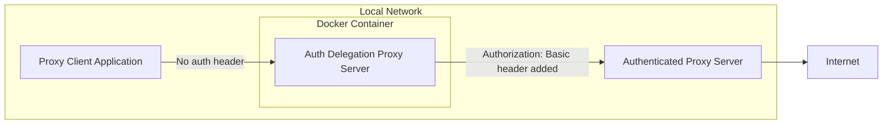

# proxy-docker

A proxy server which adds a Basic Authorization header for another proxy.  
Alpine base image, using Squid.

## Features

 * Requres Docker Compose only
 * No proxy configurations are needed before launch

## Overview



## Launch

1. Clone repository
```Shell
git clone https://github.com/k-ishigaki/proxy-docker
```

2. Move into the project directory
```Shell
cd proxy-docker
```

3. Load Alpine image
```Shell
docker load -i ./alpine.tar
```

4. Prepare .env
```Shell
cp .env.example .env
vi .env
```
Make sure to set `HTTP_PROXY_FOR_PROXY` in `.env` (required).

5. Run in background
```Shell
docker compose up -d
```

6. Test the connection
```Shell
curl -x localhost:8080 https://www.google.com
```
If you changed `HOST_BIND_PORT`, use that value instead of `8080`.

## Exit and remove all

```Shell
docker compose down --rmi all --volume
```

## Add direct access domains

You can add direct access (no proxy) domains to `.direct_access_domains`.  
Squid will access to these domains directly.
