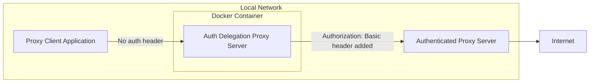

# Dockerized Auth-Delegating Proxy for Upstream Servers

A proxy server that adds a Basic Authorization header for another proxy.  
Alpine-based image built on Squid.

Japanese reference (Qiita): https://qiita.com/Splascope/items/98c6bbcd76ff54a8f723

## Features

 * Requires only Docker Compose
 * No system-wide proxy settings are needed before launch

## Overview



## Prerequisites

 * Docker
 * Docker Compose

## Setup

1. Clone the repository
```Shell
git clone https://github.com/k-ishigaki/proxy-docker
```

2. Move into the project directory
```Shell
cd proxy-docker
```

3. Load the bundled Alpine image
```Shell
docker load -i ./alpine.tar
```

4. Create and edit `.env`
```Shell
cp .env.example .env
vi .env
```
Make sure to set `HTTP_PROXY_FOR_PROXY` in `.env` (required).

## Run

1. Start in the background
```Shell
docker compose up -d
```

## Verify

1. Test connectivity
```Shell
curl -x localhost:8080 https://www.google.com
```
If you changed `HOST_BIND_PORT`, use that value instead of `8080`.

## Operations & Config

### Add direct access domains

Add direct-access (no proxy) domains to `.direct_access_domains`.  
Squid will access these domains directly.

Example:
```text
example.com
api.example.com
```

## Stop & Cleanup

```Shell
docker compose down --rmi all --volume
```
